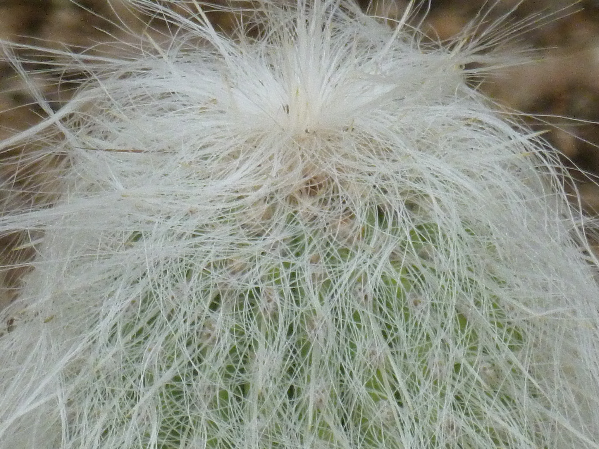

# furry-cactus



## Dependencies

See `package.json`. Use `npm install` to install dependencies.

Node >= 4 is required.

## Testing

Set up and run the following:

```bash
# don't send stats to services
export DRY_RUN=true
# AWS access
export AWS_ACCESS_KEY=
export AWS_SECRET_KEY=
# environment running against
export ENVIRONMENT=delta
# path to docker certificates
export DOCKER_CERT_PATH=/tmp/docker_certs
# Swarm connection information
export SWARM_HOSTNAME=127.0.0.1
export SWARM_PORT=2375

# let's go
npm start
```
